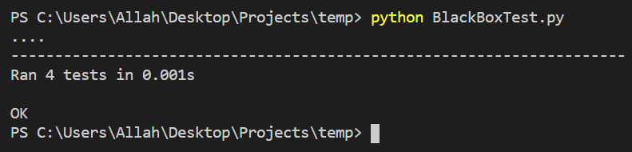
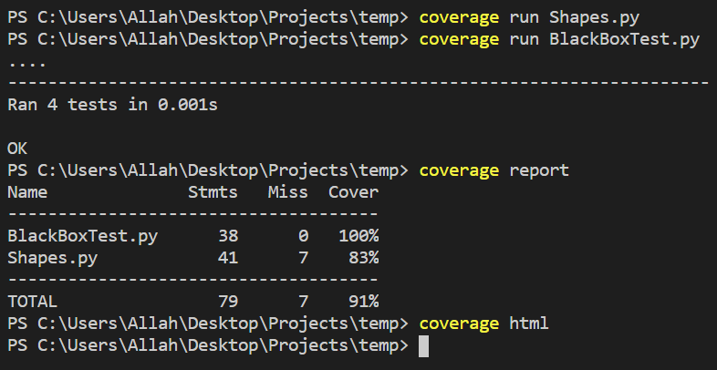
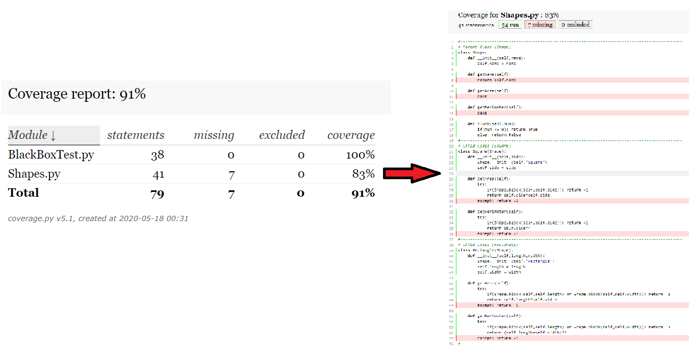
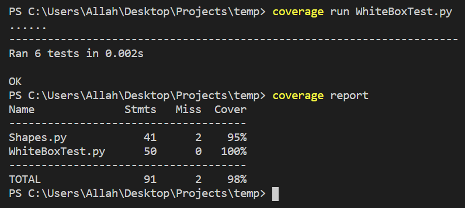

# Black Box Testing

# White Box Testing
* **`Step 1) get Black Box Testing code coverage ratio and display uncovered code (test result is 83% coverage which is not sufficient)`**

* **`Step 2) covering uncovered code with White Box Testing and retest the program with White Box Testing and print code coverage ratio  (test result is 95% coverage and it is pass all 6 tests which is sufficient)`** 

